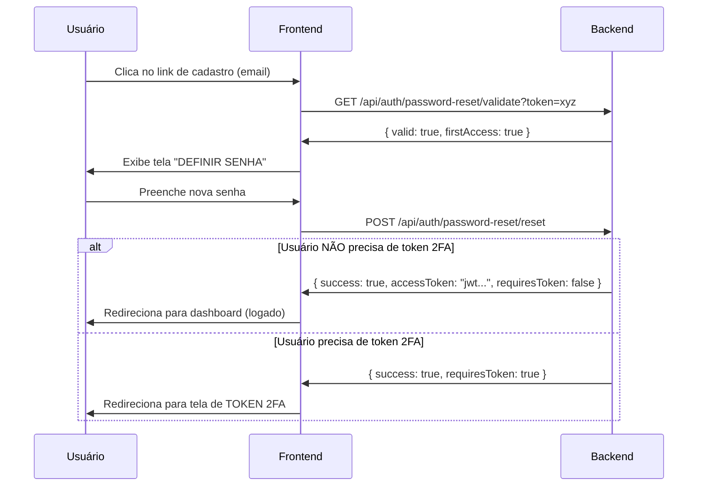
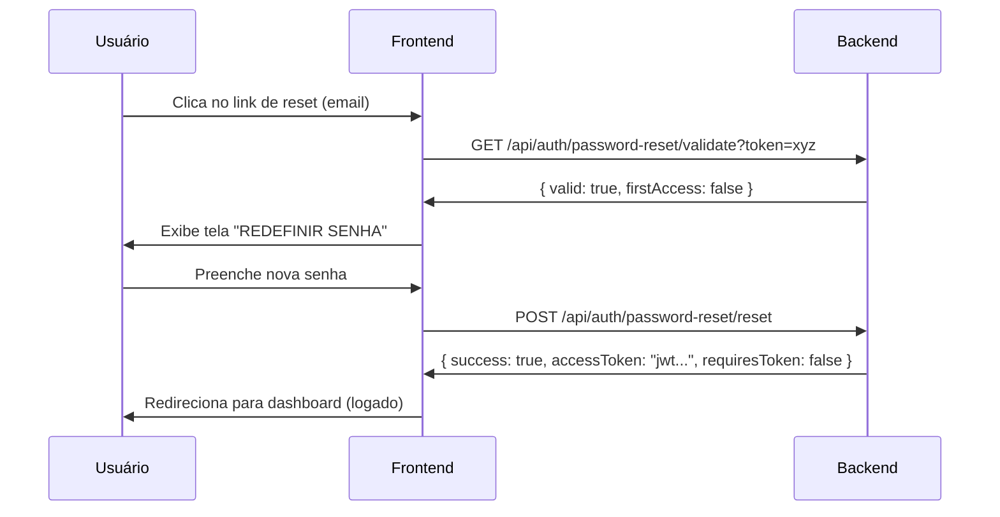
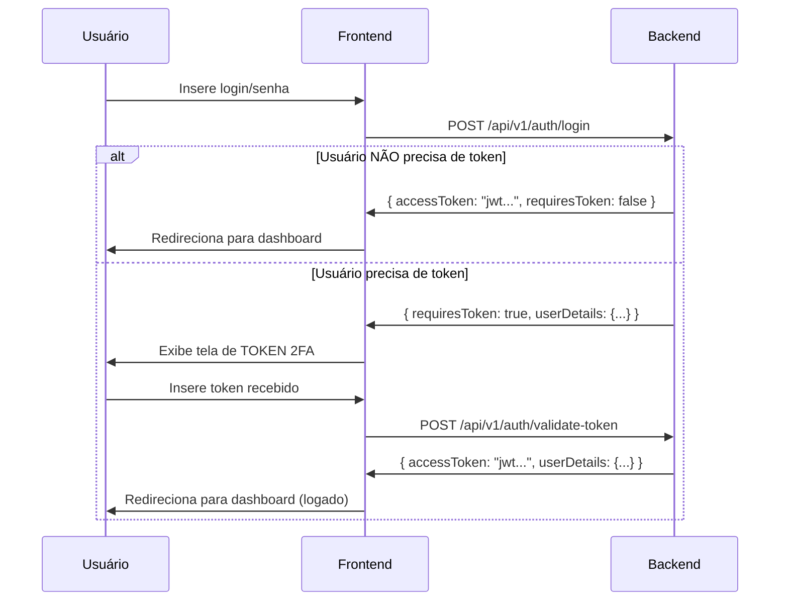

# Guia de Integração Frontend - Sistema de Autenticação e Tokens

## 📋 Sumário

1. [Distinção entre Reset de Senha e Cadastro](#distinção-entre-reset-de-senha-e-cadastro)
2. [Fluxos de Autenticação](#fluxos-de-autenticação)
3. [Endpoints da API](#endpoints-da-api)
4. [Exemplos de Implementação](#exemplos-de-implementação)
5. [Estados e Transições](#estados-e-transições)

---

## 🔍 Distinção entre Reset de Senha e Cadastro

### Como o Frontend Identifica o Tipo de Fluxo?

O sistema usa **o mesmo token** para ambos os fluxos, mas o frontend pode distinguir através do campo `firstAccess` retornado na validação:

#### Endpoint de Validação
```
GET /api/auth/password-reset/validate?token={token}
```

#### Resposta
```json
{
  "valid": true,
  "message": "Token is valid",
  "firstAccess": true  // ← Este campo determina o fluxo
}
```

### Lógica de Decisão
- **`firstAccess: true`** → Fluxo de **CADASTRO** (primeira definição de senha)
- **`firstAccess: false`** → Fluxo de **RESET** (redefinição de senha existente)
- **`firstAccess: null`** → Token inválido

---

## 🔄 Fluxos de Autenticação

### 1. Fluxo de Cadastro (Primeiro Acesso)



### 2. Fluxo de Reset de Senha



### 3. Fluxo de Login com 2FA



---

## 🔗 Endpoints da API

### 1. Validação de Token de Reset/Cadastro

```http
GET /api/auth/password-reset/validate?token={token}
```

**Resposta:**
```json
{
  "valid": boolean,
  "message": string,
  "firstAccess": boolean | null
}
```

### 2. Reset/Definição de Senha

```http
POST /api/auth/password-reset/reset
Content-Type: application/json

{
  "token": "uuid-token-here",
  "newPassword": "Nova@123",
  "confirmPassword": "Nova@123"
}
```

**Resposta (sem 2FA):**
```json
{
  "success": true,
  "message": "Senha definida com sucesso",
  "accessToken": "jwt-token-here",
  "refreshToken": "refresh-token-here",
  "userDetails": { ... },
  "requiresToken": false
}
```

**Resposta (com 2FA):**
```json
{
  "success": true,
  "message": "Senha definida com sucesso",
  "requiresToken": true
}
```

### 3. Login

```http
POST /api/v1/auth/login
Content-Type: application/json

{
  "username": "usuario@email.com",
  "password": "senha123"
}
```

**Resposta (sem 2FA):**
```json
{
  "accessToken": "jwt-token-here",
  "token": "refresh-token-here",
  "userDetails": { ... },
  "requiresToken": false
}
```

**Resposta (com 2FA):**
```json
{
  "accessToken": null,
  "token": null,
  "userDetails": { ... },
  "requiresToken": true
}
```

### 4. Validação de Token 2FA

```http
POST /api/v1/auth/validate-token
Content-Type: application/json

{
  "userId": 123,
  "token": "A1b2C"
}
```

**Resposta (sucesso):**
```json
{
  "accessToken": "jwt-token-here",
  "token": "refresh-token-here",
  "userDetails": { ... }
}
```

**Resposta (erro):**
```json
{
  "error": "TOKEN_INVALIDO" // ou "TOKEN_EXPIRADO"
}
```

---

## 💻 Exemplos de Implementação

### React/JavaScript - Validação de Token

```javascript
// Função para validar token e determinar o fluxo
async function validatePasswordToken(token) {
  try {
    const response = await fetch(
      `/api/auth/password-reset/validate?token=${token}`
    );
    const data = await response.json();
    
    if (!data.valid) {
      // Token inválido - redirecionar para página de erro
      window.location.href = '/token-invalido';
      return;
    }
    
    if (data.firstAccess === true) {
      // Fluxo de CADASTRO - primeira definição de senha
      showPasswordForm({
        title: 'Definir Senha',
        subtitle: 'Defina sua senha para acessar o sistema',
        isFirstAccess: true
      });
    } else if (data.firstAccess === false) {
      // Fluxo de RESET - redefinição de senha
      showPasswordForm({
        title: 'Redefinir Senha',
        subtitle: 'Digite sua nova senha',
        isFirstAccess: false
      });
    }
    
  } catch (error) {
    console.error('Erro ao validar token:', error);
    window.location.href = '/erro';
  }
}
```

### React/JavaScript - Definir/Reset Senha

```javascript
async function resetPassword(token, newPassword, confirmPassword, isFirstAccess) {
  try {
    const response = await fetch('/api/auth/password-reset/reset', {
      method: 'POST',
      headers: {
        'Content-Type': 'application/json'
      },
      body: JSON.stringify({
        token,
        newPassword,
        confirmPassword
      })
    });
    
    const data = await response.json();
    
    if (!data.success) {
      showError(data.message);
      return;
    }
    
    if (data.requiresToken === true) {
      // Usuário precisa validar token 2FA
      showMessage('Senha definida! Verifique seu email/SMS para o código de segurança.');
      redirectToTokenValidation(data.userDetails);
    } else {
      // Login automático realizado
      saveTokens(data.accessToken, data.refreshToken);
      saveUserData(data.userDetails);
      window.location.href = '/dashboard';
    }
    
  } catch (error) {
    console.error('Erro ao definir senha:', error);
    showError('Erro interno. Tente novamente.');
  }
}
```

### React/JavaScript - Login com 2FA

```javascript
async function login(username, password) {
  try {
    const response = await fetch('/api/v1/auth/login', {
      method: 'POST',
      headers: {
        'Content-Type': 'application/json'
      },
      body: JSON.stringify({
        username,
        password
      })
    });
    
    const data = await response.json();
    
    if (data.requiresToken === true) {
      // Usuário precisa de token 2FA
      showMessage('Token enviado! Verifique seu email/SMS.');
      redirectToTokenValidation(data.userDetails);
    } else {
      // Login direto
      saveTokens(data.accessToken, data.token);
      saveUserData(data.userDetails);
      window.location.href = '/dashboard';
    }
    
  } catch (error) {
    console.error('Erro no login:', error);
    showError('Erro ao fazer login. Verifique suas credenciais.');
  }
}
```

### React/JavaScript - Validação Token 2FA

```javascript
async function validateTwoFactorToken(userId, token) {
  try {
    const response = await fetch('/api/v1/auth/validate-token', {
      method: 'POST',
      headers: {
        'Content-Type': 'application/json'
      },
      body: JSON.stringify({
        userId,
        token
      })
    });
    
    if (response.ok) {
      const data = await response.json();
      // Sucesso - usuário autenticado
      saveTokens(data.accessToken, data.token);
      saveUserData(data.userDetails);
      window.location.href = '/dashboard';
    } else {
      const errorData = await response.json();
      if (errorData.error === 'TOKEN_EXPIRADO') {
        showError('Token expirado. Solicite um novo token.');
      } else if (errorData.error === 'TOKEN_INVALIDO') {
        showError('Token inválido. Verifique o código digitado.');
      }
    }
    
  } catch (error) {
    console.error('Erro ao validar token:', error);
    showError('Erro interno. Tente novamente.');
  }
}
```

---

## 🔄 Estados e Transições

### Componente de Rota (React Router)

```javascript
import { useEffect, useState } from 'react';
import { useParams } from 'react-router-dom';

function PasswordTokenPage() {
  const { token } = useParams();
  const [pageState, setPageState] = useState('loading');
  const [isFirstAccess, setIsFirstAccess] = useState(false);
  
  useEffect(() => {
    validateToken();
  }, [token]);
  
  async function validateToken() {
    try {
      const response = await fetch(
        `/api/auth/password-reset/validate?token=${token}`
      );
      const data = await response.json();
      
      if (!data.valid) {
        setPageState('invalid');
        return;
      }
      
      setIsFirstAccess(data.firstAccess === true);
      setPageState('form');
      
    } catch (error) {
      setPageState('error');
    }
  }
  
  if (pageState === 'loading') {
    return <LoadingSpinner />;
  }
  
  if (pageState === 'invalid') {
    return <TokenInvalidPage />;
  }
  
  if (pageState === 'error') {
    return <ErrorPage />;
  }
  
  return (
    <PasswordForm
      title={isFirstAccess ? 'Definir Senha' : 'Redefinir Senha'}
      subtitle={isFirstAccess 
        ? 'Defina sua senha para acessar o sistema' 
        : 'Digite sua nova senha'
      }
      token={token}
      isFirstAccess={isFirstAccess}
    />
  );
}
```

---

## 📱 Fluxo de UX Recomendado

### Telas Necessárias

1. **Loading** - Validando token...
2. **Definir Senha** (primeiro acesso) - "Bem-vindo! Defina sua senha"
3. **Redefinir Senha** (reset) - "Redefina sua senha"
4. **Token 2FA** - "Digite o código enviado por email/SMS"
5. **Token Inválido** - "Link expirado ou inválido"
6. **Erro** - "Algo deu errado"

### Mensagens Contextuais

```javascript
const messages = {
  firstAccess: {
    title: 'Bem-vindo ao Sistema!',
    subtitle: 'Defina sua senha para começar a usar',
    success: 'Conta criada! Verifique seu email para o código de segurança.'
  },
  reset: {
    title: 'Redefinir Senha',
    subtitle: 'Digite sua nova senha',
    success: 'Senha alterada com sucesso!'
  },
  twoFactor: {
    title: 'Código de Segurança',
    subtitle: 'Digite o código de 5 dígitos enviado para seu email/SMS',
    resend: 'Reenviar código'
  }
};
```

---

## ⚠️ Pontos Importantes

### Segurança
- **Nunca** armazene tokens no localStorage/sessionStorage
- Use tokens apenas para redirecionamentos imediatos
- Valide sempre no backend antes de exibir formulários

### UX
- Mostre loading states durante validações
- Forneça feedback claro sobre erros
- Implemente timeout para tokens 2FA (5 minutos)

### Performance
- Cache a validação inicial do token
- Evite múltiplas chamadas de validação
- Use debounce em formulários

---

## 🔧 Troubleshooting

### Problemas Comuns

1. **Token sempre inválido**
   - Verificar se está sendo passado corretamente na URL
   - Checar se não há caracteres especiais malformados

2. **firstAccess sempre null**
   - Usuário pode não existir no sistema
   - Token pode estar corrompido

3. **2FA não funciona**
   - Verificar se userId está sendo passado corretamente
   - Confirmar se token tem exatamente 5 caracteres

### Debug

```javascript
// Adicionar logs para debug
console.log('Token recebido:', token);
console.log('Resposta da validação:', validationResponse);
console.log('Estado firstAccess:', firstAccess);
```

---

## 📞 Suporte

Para dúvidas sobre a integração, consulte:
- Documentação da API (Swagger): `/swagger-ui.html`
- Logs do backend para troubleshooting
- Exemplos de requisição/resposta neste documento

---

*Última atualização: Dezembro 2024*